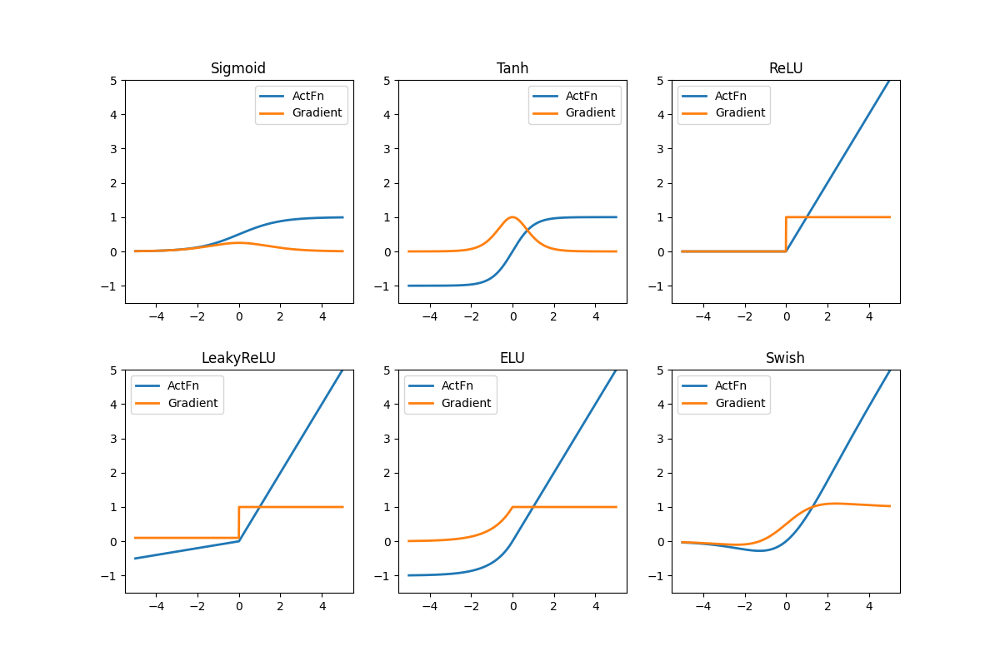
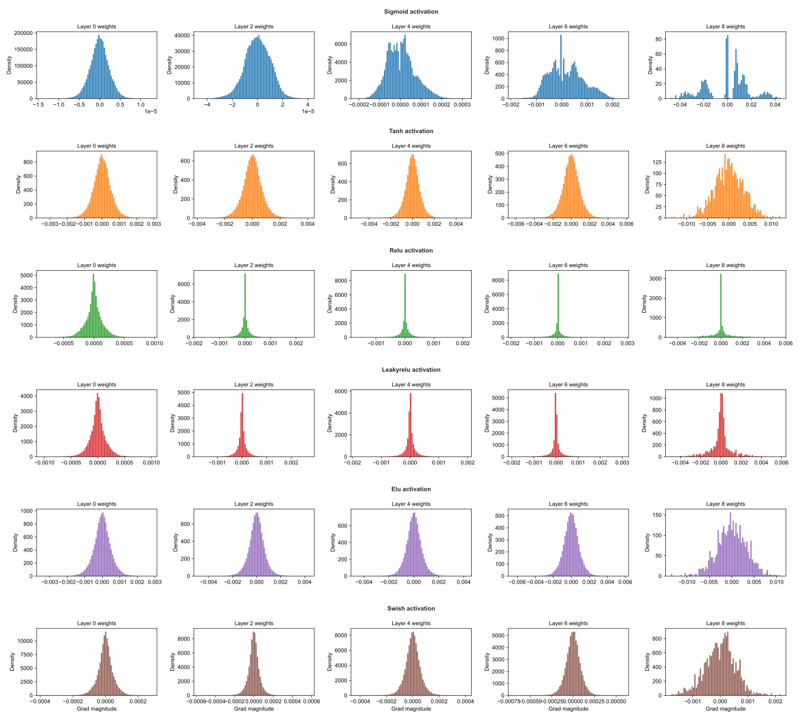

# JAX_practice

This repository contains basic to modern machine learning models using JAX, mostly from scratch.
It also contains code that is used to consolidate the understanding of each function from JAX.

## AutoEncoder
Created an AutoEncoder.
- Compared how reconstruction loss changes as latent dim changes.
- Using asynchronous dispatch & avoiding sync within loop (together with the built-in XLA feature of JAX), maximised usage of GPU (~95%).

## Variational AutoEncoder
Created a Variational AutoEncoder.
- Visualised the manifold stored in VAE.

<em>Figure: 2D latent space manifold generated by the VAE.</em>

## Activation Functions
Compared different activation functions.

<em>Figure: plot of different activation functions and its gradients.</em>

We can observe below that gradient when using sigmoid quickly dimishes as the layer goes higher up (due to the 1/4 limit), while ReLU has the spike at 0 (due to the negative side).

<em>Figure: plot of the weight of gradients for each layer of different activation functions.</em>

We also compared the performance of model for each activation function on FashionMNIST, and verified the existence of dead neurons in ReLU due to its flatness below 0. See the folder for more detail.