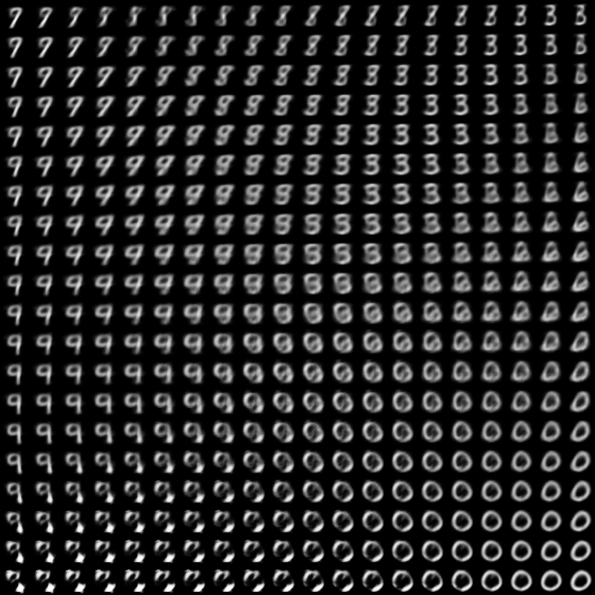

# Auto-Encoding Variational Bayes

This is an implementation of VAE based on http://arxiv.org/abs/1312.6114 using JAX.

## Results

<em>Figure: 2D latent space manifold generated by the VAE.</em>

## Model architecture
The encoder and decoder has 1 hidden layer each, with 500 hidden units.

## Takeaways
- The balance between KL divergence and BCE loss is crucial. The larger the dimension, the more likely the collapse.

## Possible further improvements
- Optimise the CPU data movement bottleneck. (The GPU is not fully utilised (currently ~28%))